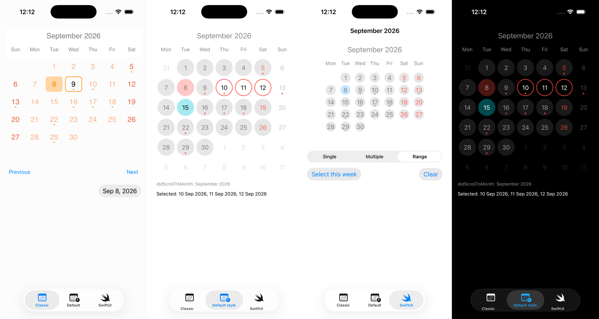

<p align="center">
  
</p>

# KDCalendar

A month calendar for iOS. Drop it in, give it a start and an end date, and it scrolls one month per page, horizontally or vertically, with today marked, weekends coloured, days selected by tap and events shown as dots.

- **UIKit and SwiftUI.** `CalendarView` for UIKit, `KDCalendarView` for SwiftUI with a two-way selection binding.
- **Any calendar.** The user's current calendar and time zone by default; Gregorian, Persian, Hebrew or anything else through `Style.calendar`, with the week starting on the day the locale says.
- **System events.** The optional `KDCalendarEventKit` product loads events from the user's calendars and adds new ones.
- **Single, multiple or range selection.** Two taps select every day between them, across months.
- **Styled by value.** `CalendarView.Style` is a struct; change a property and the view follows. Dynamic system colours and Dynamic Type by default, and a per-day style hook for holidays and disabled days.
- **Swift 6, iOS 17+.** Main-actor isolated, `Sendable` where it matters, VoiceOver labels on every day.

<p align="center">
  
</p>

## Installation

### Swift Package Manager

In Xcode choose File, then Add Package Dependencies, and enter:

```
https://github.com/mmick66/CalendarView
```

Or in `Package.swift`:

```swift
.package(url: "https://github.com/mmick66/CalendarView", from: "2.0.0")
```

Add the `KDCalendar` product to your target, and `KDCalendarEventKit` as well if you want system calendar events.

### CocoaPods

2.0.0 is the final CocoaPods release. Prefer Swift Package Manager.

```ruby
pod 'KDCalendar', '~> 2.0'            # the calendar
pod 'KDCalendar/EventKit', '~> 2.0'   # plus system events
```

## Usage

### Setup

`CalendarView` is a `UIView`. Create it in code or in a storyboard (set the module to `KDCalendar`), then give it a data source and a delegate:

```swift
import KDCalendar

let calendarView = CalendarView(frame: .zero)
calendarView.dataSource = self
calendarView.delegate = self
calendarView.direction = .horizontal
calendarView.selectionMode = .single
```

The data source returns the first and last selectable day. Every month those days touch is shown; days before the start or after the end are greyed out. Without a data source the view shows the current month.

```swift
extension ViewController: CalendarViewDataSource {
    func startDate() -> Date { Calendar.current.date(byAdding: .month, value: -1, to: Date())! }
    func endDate() -> Date { Calendar.current.date(byAdding: .month, value: 12, to: Date())! }
}
```

The delegate hears about scrolling and selection. Only the first two methods are required.

```swift
extension ViewController: CalendarViewDelegate {
    func calendar(_ calendar: CalendarView, didScrollToMonth date: Date) { }
    func calendar(_ calendar: CalendarView, didSelectDate date: Date, withEvents events: [CalendarEvent]) { }
    func calendar(_ calendar: CalendarView, canSelectDate date: Date) -> Bool { true }
    func calendar(_ calendar: CalendarView, didDeselectDate date: Date) { }
    func calendar(_ calendar: CalendarView, didLongPressDate date: Date, withEvents events: [CalendarEvent]?) { }
}
```

The view holds both weakly, so keep them alive yourself. A view controller that owns the calendar is the usual arrangement.

### Dates

Every date the view computes or hands out is the start of a day in `calendarView.calendar`, which is `style.calendar` and defaults to `Calendar.current`. `didScrollToMonth` receives the first day of the month. To work in another time zone or calendar, set one on the style:

```swift
var style = CalendarView.Style()
style.calendar = Calendar(identifier: .persian)
style.firstWeekday = .automatic       // the calendar's own first weekday
calendarView.style = style
```

### Scrolling

```swift
calendarView.setDisplayDate(Date())                 // jump to a month
calendarView.setDisplayDate(date, animated: true)   // scroll to it
calendarView.goToNextMonth()
calendarView.goToPreviousMonth()
calendarView.isScrollEnabled = false                // buttons only
calendarView.displayDate                            // the first day of the month on screen
```

Call `setDisplayDate` from `viewDidAppear` or later; before that the view has no size to scroll.

### Selection

```swift
calendarView.selectionMode = .multiple   // .single, .multiple or .range
calendarView.selectDate(date)            // same rules as a tap: in range, canSelectDate allows it
calendarView.deselectDate(date)
calendarView.selectRange(monday...friday)
calendarView.selectedDates               // in selection order
calendarView.clearAllSelectedDates()     // no delegate callbacks
calendarView.enableDeselection = false   // taps cannot deselect; deselectDate still can
```

In `.single` mode selecting a day deselects the previous one and reports it. In `.range` mode the first tap picks one end, the second picks the other and every selectable day between them is selected, in either order and across months; the delegate then receives `didSelectRange`. A third tap starts a new range and tapping a selected day clears it. `multipleSelectionEnable` still works and maps to `.single` and `.multiple`.

### Styling

`CalendarView.Style` is a value. Change what you need and assign it, or mutate the view's style in place.

```swift
var style = CalendarView.Style()
style.cellShape = .round               // .round, .square or .bevel(radius)
style.cellColorToday = .systemOrange.withAlphaComponent(0.3)
style.cellSelectedBorderColor = .systemOrange
style.cellEventColor = .systemOrange
style.firstWeekday = .sunday           // .sunday, .monday, .saturday or .automatic
style.showAdjacentDays = true          // the neighbouring months' days in the empty cells
style.locale = Locale(identifier: "en_US")
calendarView.style = style

calendarView.style.headerFont = .preferredFont(forTextStyle: .title2)   // also restyles
calendarView.marksWeekends = true
```

The defaults are dynamic system colours, so a calendar follows dark mode, and fonts scaled for Dynamic Type. Custom colours and fonts are used as given.

The data source can replace the month title:

```swift
func headerString(_ date: Date) -> String? { date.formatted(.dateTime.month(.wide)) }
```

The delegate can style single days. Return `nil` for the calendar's own style. Together with `canSelectDate` this greys out days the user must not pick:

```swift
func calendar(_ calendar: CalendarView, canSelectDate date: Date) -> Bool {
    !Calendar.current.isDateInWeekend(date)
}

func calendar(_ calendar: CalendarView, styleForDate date: Date) -> CalendarView.Style? {
    guard Calendar.current.isDateInWeekend(date) else { return nil }
    var disabled = calendar.style
    disabled.cellTextColorWeekend = disabled.cellColorOutOfRange
    disabled.cellColorDefault = .clear
    return disabled
}
```

### Events

`events` is an array of `CalendarEvent`; a day gets a dot for every event that covers it, and `didSelectDate` receives that day's events.

```swift
calendarView.events = [
    CalendarEvent(title: "Launch", startDate: launch, endDate: launch.addingTimeInterval(3600))
]
```

To show the user's system calendars, add the `KDCalendarEventKit` product and declare `NSCalendarsFullAccessUsageDescription` in your Info.plist. The first call asks for access.

```swift
import KDCalendarEventKit

try await calendarView.loadEvents()                     // or the completion form
calendarView.addEvent("Dinner", date: date, duration: 2) // hours; false if access is missing
```

### SwiftUI

```swift
import KDCalendar

struct ContentView: View {
    @State private var selection: [Date] = []

    var body: some View {
        KDCalendarView(range: start...end, selection: $selection)
            .calendarStyle(style)
            .selectionMode(.range)
            .styleForDate { date in holidays.contains(date) ? holidayStyle : nil }
            .events(events)
            .displayDate(Date())
            .onScrollToMonth { month in print(month) }
            .aspectRatio(1, contentMode: .fit)
    }
}
```

Taps update the binding; assigning to it selects or deselects days.

## Example app

`Example/KDCalendarDemo.xcodeproj` has three tabs: the classic styled calendar with system events, the default style in a vertical calendar with disabled Sundays and a holiday, and the SwiftUI wrapper with the three selection modes. Launch with `-sampleEvents` to seed events without calendar access and `-tab 1` or `-tab 2` to open a tab.

## Development

```
xcodebuild -scheme KDCalendar-Package -destination 'platform=iOS Simulator,name=iPhone 17 Pro' test
xcodebuild -project Example/KDCalendarDemo.xcodeproj -scheme KDCalendarDemo -destination 'platform=iOS Simulator,name=iPhone 17 Pro' build
xcrun swift-format lint --strict --recursive Sources Tests Example/KDCalendarDemo
```

Requires Xcode 26. Documentation is a DocC catalog in `Sources/KDCalendar/KDCalendar.docc`, including a guide for migrating from 1.x.

## License

MIT. See [LICENSE](LICENSE).
